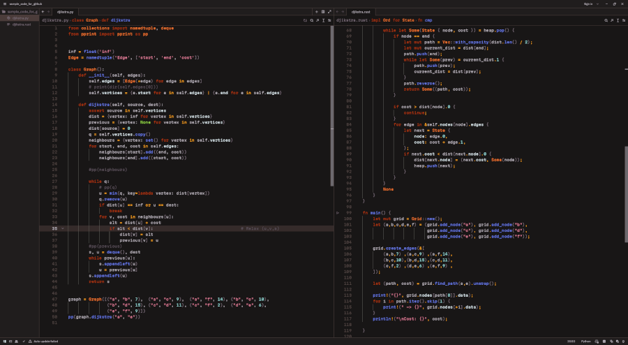

  <h1 align="center">Martianized</h3>
  

## About The Project

Martianized is a dark color scheme I created for the Zed text editor.

### Installation

Just copy martianized.json into the "themes" folder in Zed's config directory, ex:

~/.config/zed/themes/martianized.json

## Sample
Font shown is [Martian Mono](https://github.com/evilmartians/mono)

## Hex Color Codes
#181616

#201D1D

#4B3C3A

#514543

#5C515B

#7F717D

#BAB3BC

#DDE9EE

#FFA51F

#FF7A33

#AE360A

#E17F99

#C79EEA

#6B7CEB

#98DDDA

#99DE4A

## Acknowledgments

* [Solarized](https://ethanschoonover.com/solarized/) - My primary inspiration for the project
